# Adaptive Multi-Mode Control System for a Robotic Arm

A Wi-Fi–based, gesture-controlled robotic arm system that lets an operator drive a robotic arm using natural hand movements — no complex coding or teach-pendant programming required. The system also supports saving and replaying motion sequences and a manual joystick override, all switchable on the fly.

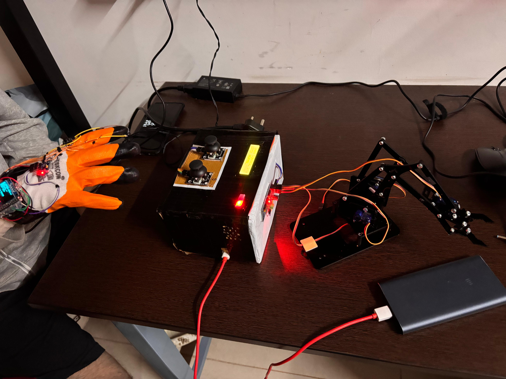
*Module‑1 (glove) worn on the hand, Module‑2 control unit (joysticks, LCD, status LEDs), and the 4‑DOF robotic arm — fully integrated and powered.*

**Project Presented by: Group 4**
- Aryan Raj Patra (24BLC1222)
- Dishan C. Panchigar (24BLC1217)
- Neerjyoti Patowary (24BLC1154)
- Rudra Purohit (24BLC1152)

School of Electronics Engineering (SENSE)

---

## Table of Contents

- [Abstract](#abstract)
- [Introduction](#introduction)
- [Key Concept: Arm-States](#key-concept-arm-states)
- [Operating Modes](#operating-modes)
- [System Architecture](#system-architecture)
  - [Module-1: System Controlling Glove](#module-1-system-controlling-glove)
  - [Module-2: Robot Driving System](#module-2-robot-driving-system)
- [Components Used](#components-used)
- [Circuit Diagrams & Wiring](#circuit-diagrams--wiring)
- [Firmware Logic / Algorithms](#firmware-logic--algorithms)
- [Servo Channel Mapping](#servo-channel-mapping)
- [Gallery](#gallery)
- [Demo Videos](#demo-videos)
- [Results](#results)
- [Conclusion](#conclusion)
- [Future Scope](#future-scope)
- [Repository Contents](#repository-contents)
- [Full Project Report](#full-project-report)

---

## Abstract

The rapid advancement of modern industrial automation and intelligent robotics has created a growing need for control mechanisms that are adaptive and user-friendly, reducing reliance on traditional programming methods. This project implements a **multi-mode robotic arm control system** designed to operate any robotic arm within its mechanical and electrical specifications, offering intuitive, flexible, and efficient control. Operators can program the arm using natural hand gestures, with no need for complicated coding.

The system consists of two modules — **Module-1**, a *System Controlling Glove*, and **Module-2**, the *Robot Driving System* — connected wirelessly over Wi-Fi via TCP. Hand orientations and button inputs are mapped into sets of servo angles called **Arm-States**, representing the base, shoulder, elbow, and claw positions of the arm. Up to **30 Arm-States** can be stored and replayed sequentially or cyclically, enabling programmable motion sequences across **four operating modes**.

## Introduction

Automation and robotics are vital pillars of the Industry 4.0 era. As robotic systems become more integrated into manufacturing, assembly, and precision-based industries, the demand for control systems that are efficient, easy to operate, and adaptive keeps growing. Traditional robotic arms rely on heavy programming interfaces that require technical know-how, limiting their operation to skilled personnel.

This project bridges that gap with a multi-mode robotic arm control system that supports several intuitive control modes — gesture recognition, pre-programmed motion sequences, and manual joystick override — without requiring any complex coding.

- **Module-1 (Robot Controlling Glove)** — built around an **ESP32 Dev Module** with an **MPU6050 IMU** that captures hand orientation, plus several state buttons for claw control, saving, executing, and resetting programs. Status is shown on an OLED screen, and data is streamed over Wi-Fi via TCP.
- **Module-2 (Robot Driving System)** — implemented on an **Arduino UNO R4 Wi-Fi**, connected to a **PCA9685 servo driver** that drives the servos for the arm's base, shoulder, elbow, and claw joints.

Detected hand motions and button presses are mapped into predefined angular positions (Arm-States), which can be recorded and replayed sequentially or in loops. This design supports four modes: **Hand-Controlled**, **Programmed Single-Execution**, **Programmed Loop-Execution**, and **Joystick Override** — allowing the system to switch between real-time control and automated playback with efficiency, flexibility, and accessibility for industrial robotics applications.

## Key Concept: Arm-States

Hand movement — particularly rotation at the wrist about two axes — maps to unique points that can drive a system variable within a defined range. This is captured using an IMU/Gyro-Sensor and converted into processable data.

For a 4 Degree-of-Freedom (DOF) robotic arm with four servo motors, each servo sits at a particular angle at any instant, producing a unique arm position. This is formalized as an **Arm-State**:

> "A set of angles and states of all the servo/stepper motors at a particular instance of time."

**Example:** If at some instant the servo angles are Base = 65°, Shoulder = 120°, Elbow = 136°, Claw = 15°, the Arm-State for that instance is:

```
[65, 120, 136, 15]   // order: Base, Shoulder, Elbow, Claw
```

Arm-States can be used to drive and *program* a robotic arm — for example, defining an `Initial` and a `Target` Arm-State so the arm automatically moves its servos from the initial angles to the target angles.

For programming a specific action, an **array of Arm-States** is built up in sequential order. When executed, each Arm-State is fed to the arm in chronological order, driving the servos so the arm moves/navigates from one position to the next automatically.

## Operating Modes

| Mode | Description |
|---|---|
| **Hand-Controlled** | Default mode. The arm is controlled directly using wrist movements. |
| **Programmed Single-Execution** | Operator saves a sequence of Arm-States using **SAVE**, then presses **RUN** to execute the saved sequence once. |
| **Programmed Loop-Execution** | Operator saves a sequence of Arm-States using **SAVE**, then presses **RUN + CLAW** together to execute the sequence in a continuous loop. Press **RESET** to exit. |
| **Joystick Override** | Activated the moment the operator moves the joystick. Joystick displacement maps directly to servo angles. This mode has the **highest priority**, overriding any of the above three modes. |

## System Architecture

The system is composed of two wirelessly-linked modules communicating over Wi-Fi via TCP.

### Module-1: System Controlling Glove

Built on an **ESP32** as the controller glove — responsible for collecting motion and button data and transmitting it wirelessly to the robotic arm.

**Boot & connection sequence:**
1. On boot, the ESP32 checks that the OLED display and MPU6050 sensor initialize correctly, printing **"System Ready"** on the OLED once confirmed.
2. It then connects to a pre-configured Wi-Fi network; the OLED shows the Wi-Fi SSID and the device's IP address.
3. It waits for Module-2 to connect. Once connected, it streams its key variables continuously: **Base, Shoulder, Elbow, Claw, Save, Run, Reset** — with the OLED reflecting each variable's state in real time.

**Transmitted variables:**

| Variable | Values |
|---|---|
| `Base` | `1` = rotate +X axis, `2` = rotate −X axis, `0` = no rotation |
| `Shoulder` | `1` = rotate +Y axis, `2` = rotate −Y axis, `0` = no rotation |
| `Elbow` | `1` = rotate +Z axis, `2` = rotate −Z axis, `0` = no rotation |
| `Claw` | `1` = claw button pressed, `0` = not pressed |
| `Save` | `1` = save button pressed, `0` = not pressed |
| `Run` | `1` = run button pressed, `0` = not pressed |
| `Reset` | `1` = reset button pressed, `0` = not pressed |

### Module-2: Robot Driving System

The **Arduino UNO R4 Wi-Fi** is the receiver/actuator controller — it interprets commands from the ESP32 and turns them into precise servo movements.

- On startup, onboard LEDs blink to indicate it's waiting for a connection; once the ESP32 connects, the LEDs stop blinking, confirming a successful link.
- Data received from Module-1 is processed through a structured logic system. Each variable directly drives one of four servo channels on the **PCA9685** driver: **Base, Shoulder, Elbow, Claw**.
- Each servo has a default angle and a defined range; movements are triggered in **1° increments/decrements**, respecting constraints such as preventing simultaneous movement between dependent joints (e.g. shoulder–elbow).
- The claw simply toggles between fully open and fully closed.
- **SAVE** stores the current servo states; **RUN** replays the stored sequence in order; **RESET** clears all saved positions.
- During joystick operation, the Arduino overrides the incoming Wi-Fi data and drives the servos directly, displaying a distinct LED pattern to indicate manual override mode.

## Components Used

**Module-1: System Control Glove**
- ESP-32 30-Pin Development Board
- An insulative hand glove
- MPU-6050 IMU
- SSD1306 OLED display
- Push-buttons (CLAW, SAVE, RUN, RESET)
- Connecting wires

**Module-2: Robot Control System**
- Arduino UNO R4 Wi-Fi
- Arduino UNO R3
- PCA9685 16-channel servo shield
- Joystick modules (×2)
- 16x2 LCD display with I2C interface
- LEDs (status + override indicators)
- 5V fan
- MB102 breadboard power module
- Jumper cables
- Breadboard

**4-DOF Robotic Arm (for demonstration)**
- 4-DOF robotic arm body-kit
- SG-90 servo motors

**Software Used**
- Arduino IDE
- WOKWI cloud simulation platform

## Circuit Diagrams & Wiring

### Module-1 wiring

| Component | Component Pins | ESP32 Dev Board Pins |
|---|---|---|
| SSD1306 OLED Display | VCC / GND / SDA / SCL | 3V3 / GND / D18 / D19 |
| MPU6050 IMU | VCC / GND / SDA / SCL | 3V3 / GND / D21 / D22 |
| CLAW button (pull-up) | IN, OUT | D26, GND |
| SAVE button (pull-up) | IN, OUT | D27, GND |
| RUN button (pull-up) | IN, OUT | D14, GND |
| RESET button (pull-up) | IN, OUT | D-12, GND |

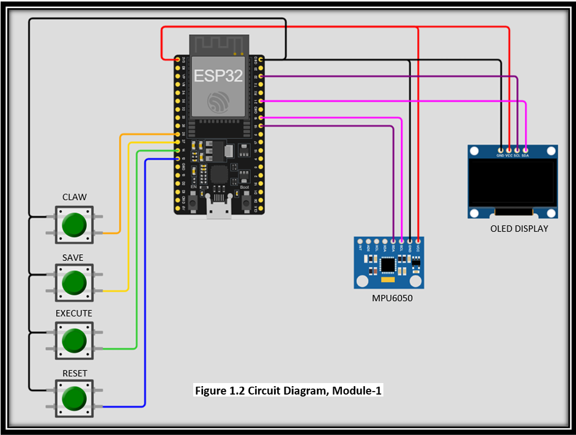
*Figure 1.2 — Circuit diagram for Module-1 (ESP32 + MPU6050 + OLED + push-buttons).*

### Module-2 wiring — base prototype

| Component | Component Pins | Arduino UNO R4 Wi-Fi Pins |
|---|---|---|
| Joystick-A | VCC / GND / VERT (Vy) / HORI (Vx) | 5V / GND / A0 / A1 |
| Joystick-B | VCC / GND / VERT (Vy) / HORI (Vx) | 5V / GND / A2 / A3 |
| PCA9685 Servo Shield | VCC / GND / V+ / OE / V+(Ext) / GND(Ext) | 5V / GND / 5V / GND / VCC (external) / GND (external → GND) |

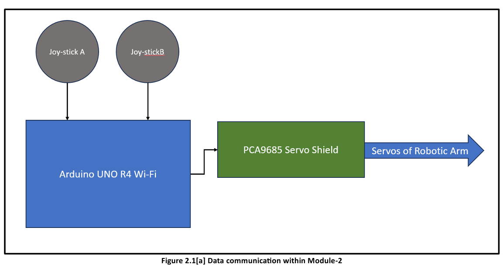
*Figure 2.1[a] — Data communication within Module-2 (base prototype).*

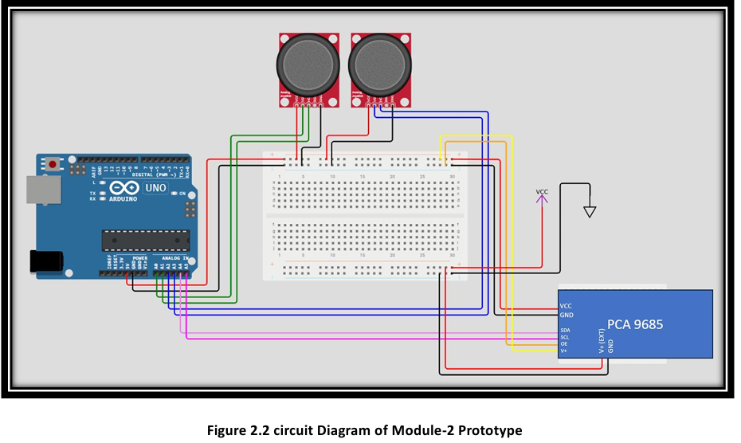
*Figure 2.2 — Circuit diagram of the Module-2 prototype (Arduino UNO, dual joysticks, PCA9685).*

### Module-2 wiring — with added accessories (status LEDs, LCD, cooling fan)

The accessories are mounted on a second, separate board (**Arduino UNO R3**) so they can be removed independently in case of power issues or under-performance.

| Component | Component Pins | Arduino UNO R3 Pins |
|---|---|---|
| Status LED | + / − | D4 / GND |
| Override LED | + / − | D5 / GND |
| Cooling fan | VCC / GND | VCC (external) / GND (external) |
| Arduino UNO R4 Wi-Fi link | D3 / D4 / GND / VCC | D2 / D3 / GND / 5V |
| 16x2 LCD (I2C) | VCC / GND / SDA / SCL | 5V / GND / A4 / A5 |
| External power supply | VCC (external) / GND (external) | Vin / GND |

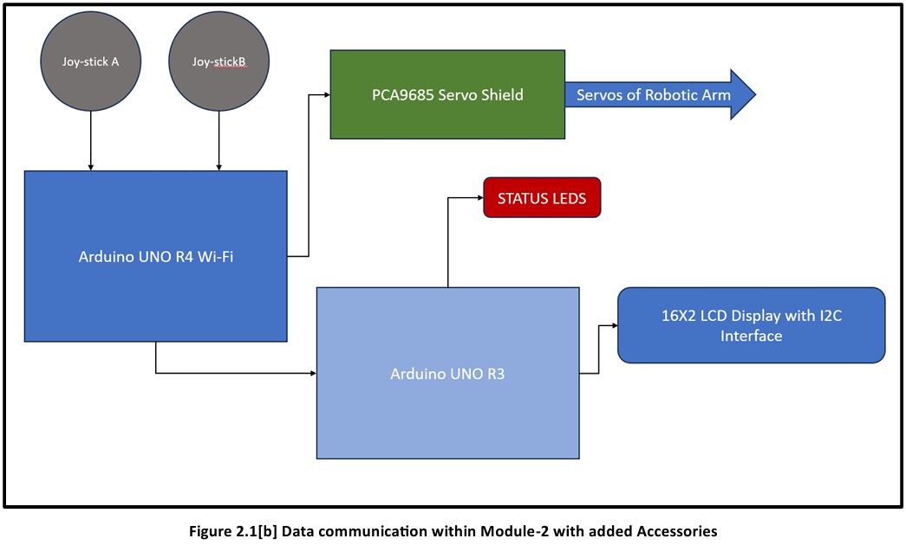
*Figure 2.1[b] — Data communication within Module-2 with added accessories (status LEDs, LCD, fan on a secondary Arduino UNO R3).*

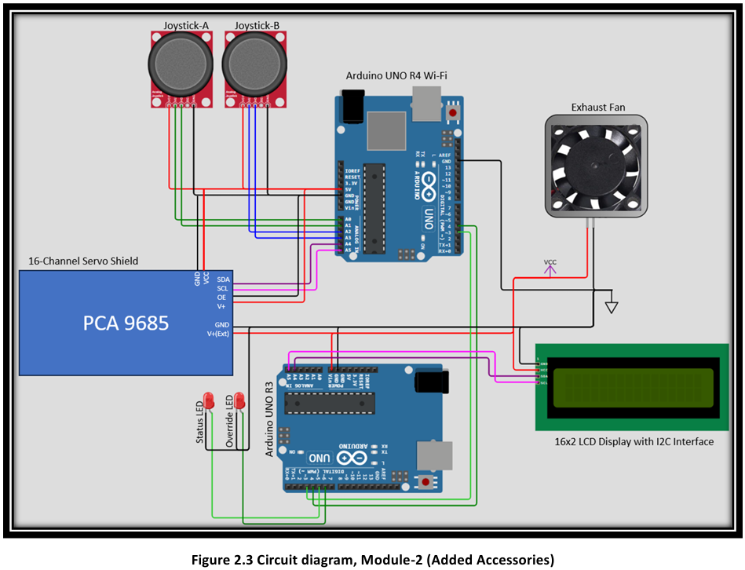
*Figure 2.3 — Circuit diagram of Module-2 with added accessories: dual joysticks, PCA9685, status/override LEDs, 16x2 I2C LCD, and cooling fan. This is the finalized design used for Module-2.*

## Firmware Logic / Algorithms

**Module-1 (ESP32)** initializes its peripherals, waits for a TCP client connection, then continuously reads the MPU6050 and push-button states, streams them over TCP, and updates the OLED with the live variable data.

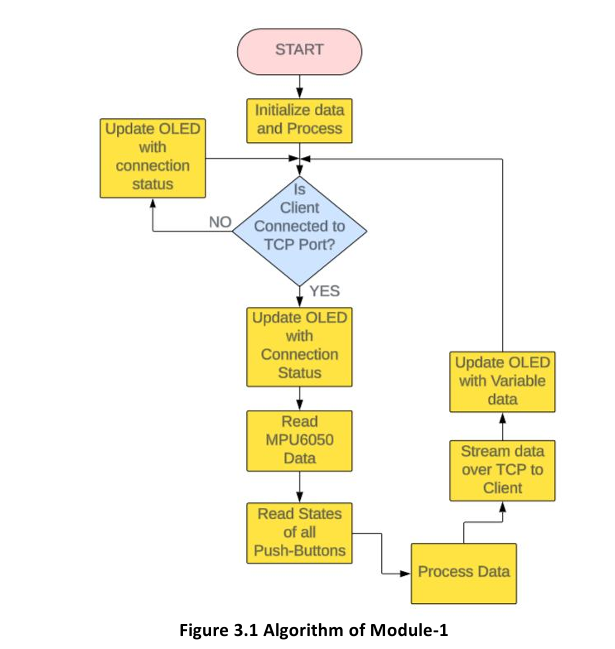
*Figure 3.1 — Algorithm of Module-1.*

**Module-2 (Arduino UNO R4 Wi-Fi)** waits for a client connection, then parses incoming data into Arm-States, drives the corresponding servo channels, and manages saving/running/looping/resetting the stored Arm-State array based on the SAVE / RUN / CLAW / RESET flags.

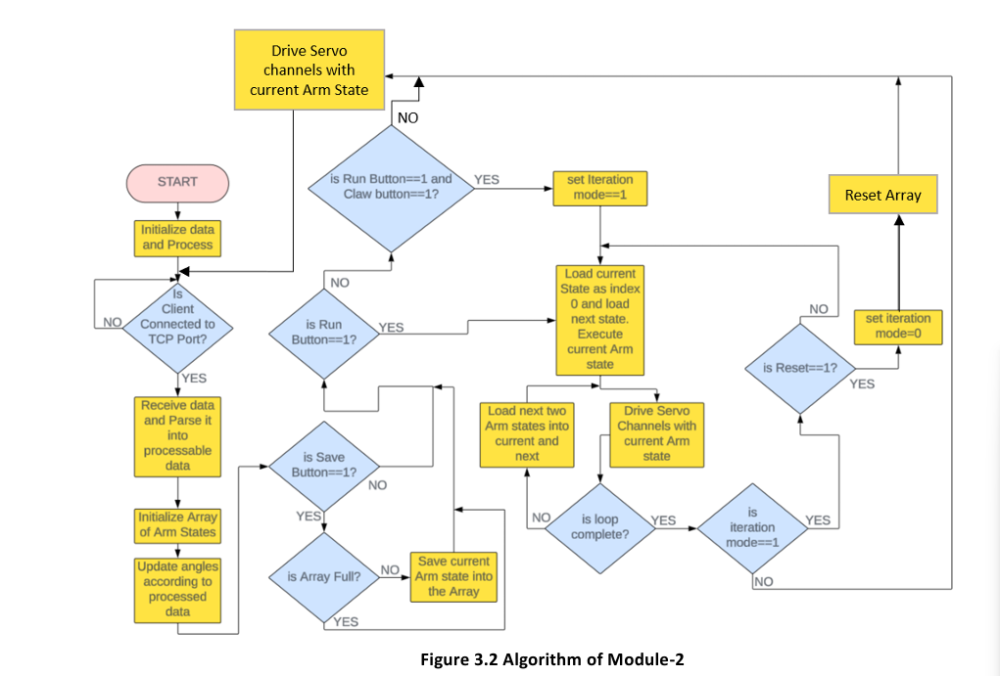
*Figure 3.2 — Algorithm of Module-2.*

### Servo Channel Mapping

The Arduino is connected to the PCA9685 servo driver as follows:

| PCA9685 Channel | Joint | Range | Default |
|---|---|---|---|
| 0 | Base | 0°–180° | 90° |
| 1 | Shoulder | 120°–160° | 135° |
| 2 | Elbow | 0°–30° | 90° |
| 3 | Claw | 0°–90° | 90° |

**Angle update rules:**

- **Base** — increases 1°/tick if `Base=1`, decreases 1°/tick if `Base=2`, unchanged if `Base=0`. *No constraints.*
- **Shoulder** — increases 1°/tick if `Shoulder=1`, decreases 1°/tick if `Shoulder=2`, unchanged if `Shoulder=0`. *Constraint: must not change while Base is changing.*
- **Elbow** — increases 1°/tick if `Elbow=1`, decreases 1°/tick if `Elbow=2`, unchanged if `Elbow=0`. *Constraint: must not change while Shoulder is changing.*
- **Claw** — snaps to 90° when `Claw=1`, snaps to 0° when `Claw=0`. *No constraints.*

**Arm-State array logic** (array size = 30):

1. `SAVE = 1` → the current Arm-State is appended to the array.
2. `RUN = 1` → all stored Arm-States are driven one by one until the last Arm-State is reached (Programmed Single-Execution).
3. `RUN = 1` **and** `CLAW = 1` → the stored Arm-States are driven in a continuous loop until `RESET = 1` (Programmed Loop-Execution).
4. `RESET = 1` → the stored Arm-State array is flushed, ready for reuse.

## Gallery

### Module-1 — System Controlling Glove

| | |
|---|---|
| 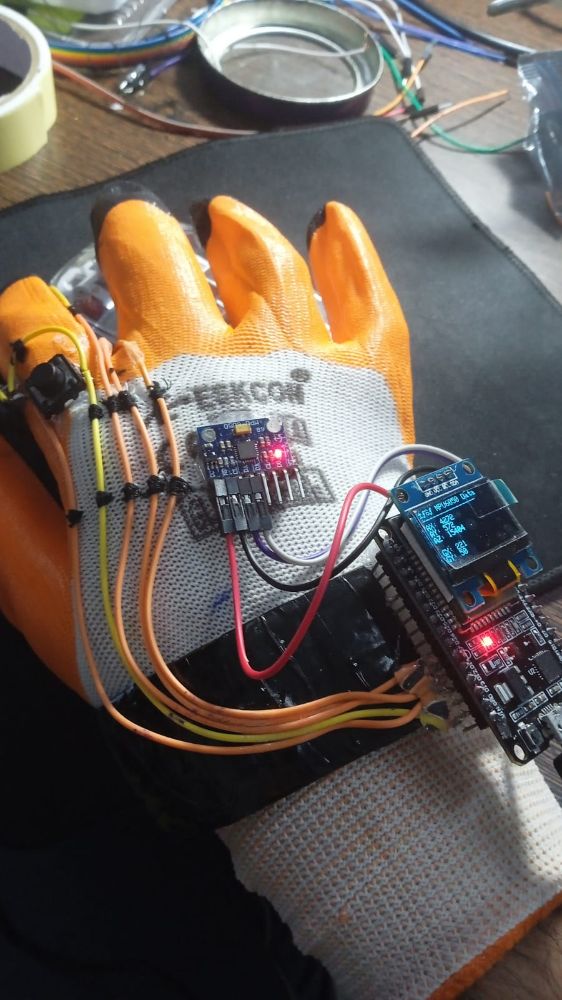 | 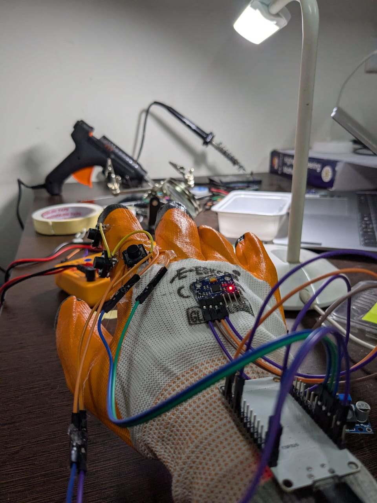 |
| 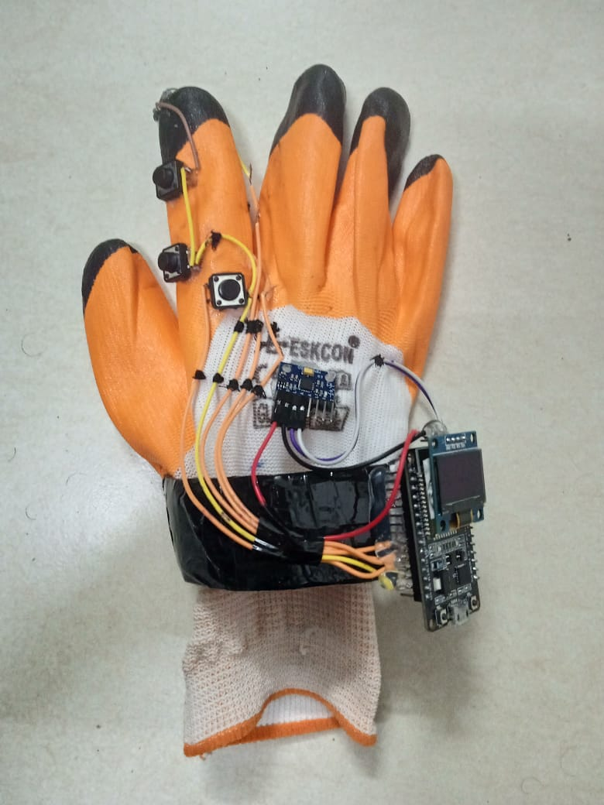 | 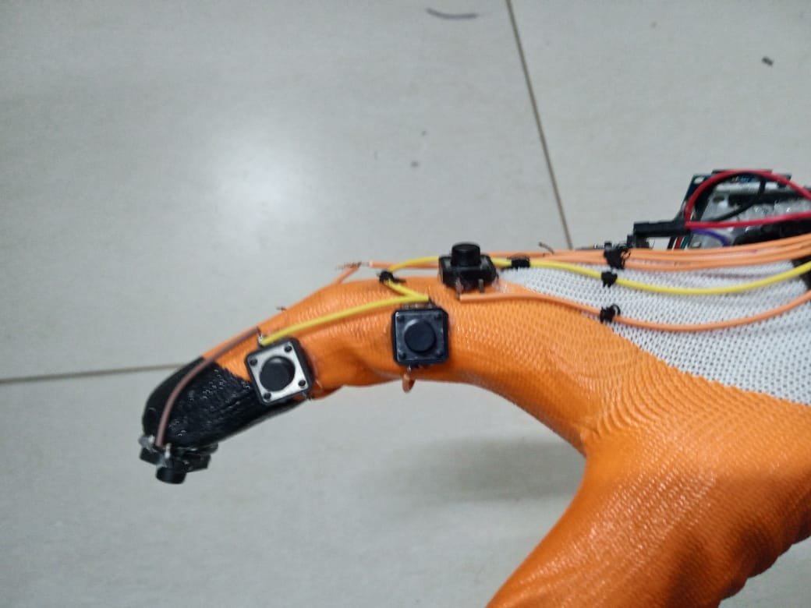 |

*The insulated glove with the MPU6050 mounted on the back of the palm, ESP32 + OLED strapped to the wrist, and CLAW / SAVE / RUN / RESET push-buttons positioned along the index finger for easy access.*

### Module-2 — Robot Driving System & Robotic Arm

| | |
|---|---|
| 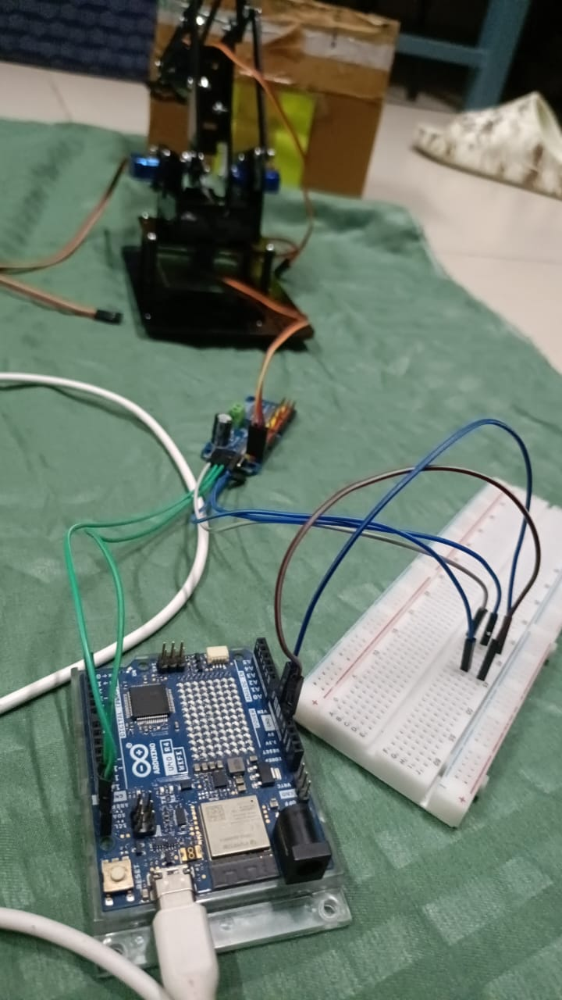 | 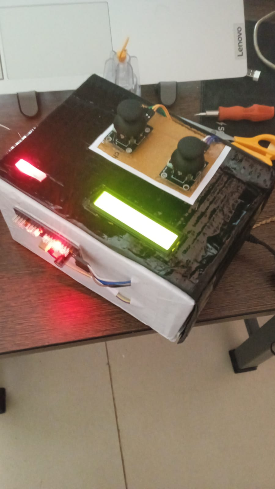 |
| 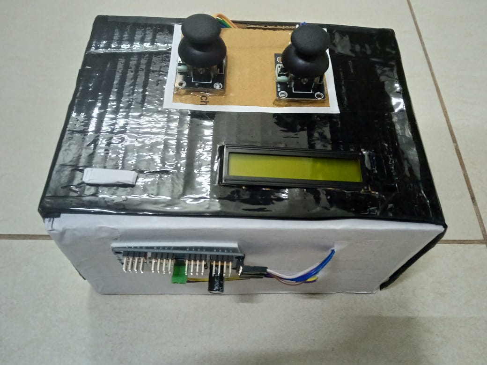 | 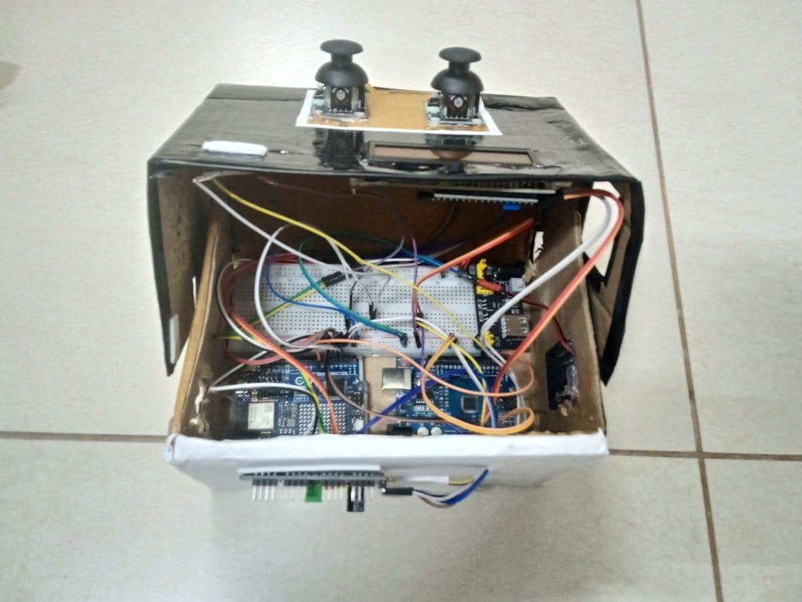 |

*The Arduino UNO R4 Wi-Fi and PCA9685 servo driver wired up and driving the 4-DOF robotic arm on the breadboard, through to the finalized control-box build with joysticks, LCD, and status LEDs.*

### Full System Integration


*The glove (Module-1), the control box (Module-2, with joysticks, LCD, and LED indicators), and the 4-DOF robotic arm — connected and powered for a live demo.*

## Demo Videos

The repository includes recorded demonstrations and test runs of the system:

- **`Demonstration.mp4`** — Full walkthrough of the system in operation.
- **`Testing.mp4`**, **`Testing_B.mp4`**, **`Testing_C.mp4`** — Individual testing sessions covering gesture control, saved/looped Arm-State playback, and joystick override.

## Results

After an extensive period of prototyping and testing, the following outcomes were achieved:

1. **Seamless Communication** — Stable, non-lagging communication was established between both modules, ensuring real-time data transfer and responsiveness.
2. **Accurate Gesture Response** — The system accurately translated hand gesture inputs into corresponding robotic arm movements.
3. **Reliable Mode Switching** — Smooth, error-free transitions between operational modes, with consistent control performance.
4. **Successful Arm-State Management** — Multiple arm states were saved, retrieved, and executed flawlessly in both Programmed Single-Execution and Programmed Loop-Execution modes, with stable, jerk-free transitions.
5. **Effective Override Functionality** — Joystick Override successfully took priority over all other modes, enabling manual real-time control whenever required.

## Conclusion

The Wi-Fi–based gesture-controlled robotic arm successfully achieved smooth, real-time communication between the ESP32 controller glove and the Arduino UNO R4 Wi-Fi. The system accurately responded to motion and button inputs, executing precise servo movements through the PCA9685 driver. Multiple operating modes — Hand-Controlled, Programmed Execution, and Joystick Override — were implemented effectively, with stable data transfer and minimal latency. The LED-based status visualization further enhanced user interaction.

## Future Scope

- Cloud-based data logging
- Camera-assisted feedback for visual guidance
- AI-driven motion prediction for enhanced precision
- Integration with mobile or web dashboards for remote monitoring and control

## Repository Contents

| File | Description |
|---|---|
| `Project_Report.pdf` | Full detailed project report (this README is derived from it) |
| `Module_1_Glove_CD.png` | Circuit diagram, Module-1 (glove) |
| `Module_1_Workflow.png` | Firmware algorithm flowchart, Module-1 |
| `Control_System.png` | Data communication diagram, Module-2 (base) |
| `Module_2_Control_System_CD_Simplified.png` | Circuit diagram, Module-2 base prototype |
| `Control_System_Prototyped.png` | Data communication diagram, Module-2 (with accessories) |
| `Module_2_Prototype_CD.png` | Circuit diagram, Module-2 with accessories (final design) |
| `Module_2_Workflow.png` | Firmware algorithm flowchart, Module-2 |
| `Glove_1.jpeg`, `Glove_2.jpeg`, `Glove_Prototype_1.jpeg`, `Glove_Prototype_2.jpeg` | Photos of the glove build |
| `Controller_1.jpeg`, `Controller_Prototype_1.jpeg`, `Controller_Prototype_2.jpeg`, `Controller_Prototype_3.jpeg` | Photos of the Module-2 control system + robotic arm |
| `Integration_1.jpeg` | Photo of the fully integrated system |
| `Demonstration.mp4` | Full system demonstration video |
| `Testing.mp4`, `Testing_B.mp4`, `Testing_C.mp4` | Individual test recordings |

## Full Project Report

For the complete write-up — including detailed connection tables, full algorithm descriptions, and the results/discussion in full — see [`Project_Report.pdf`](Project_Report.pdf).
